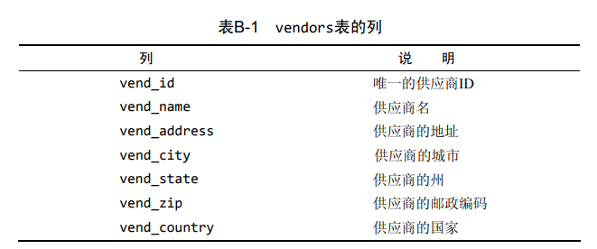
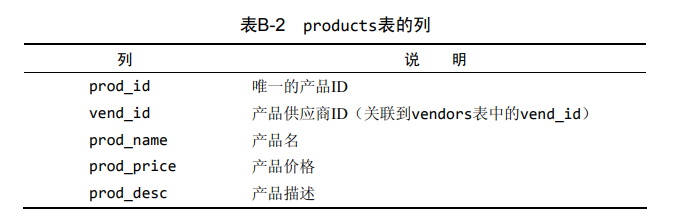
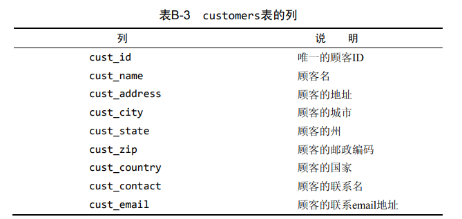
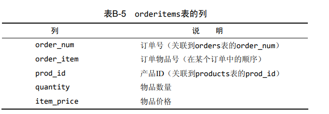
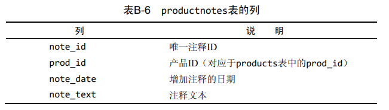
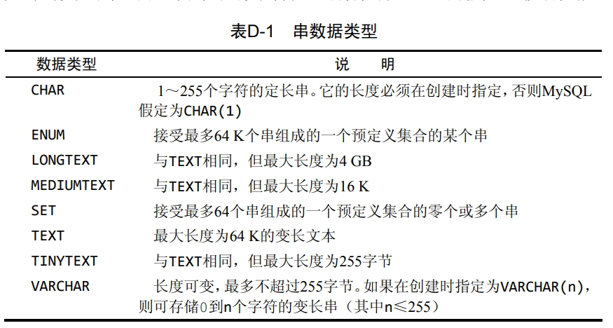
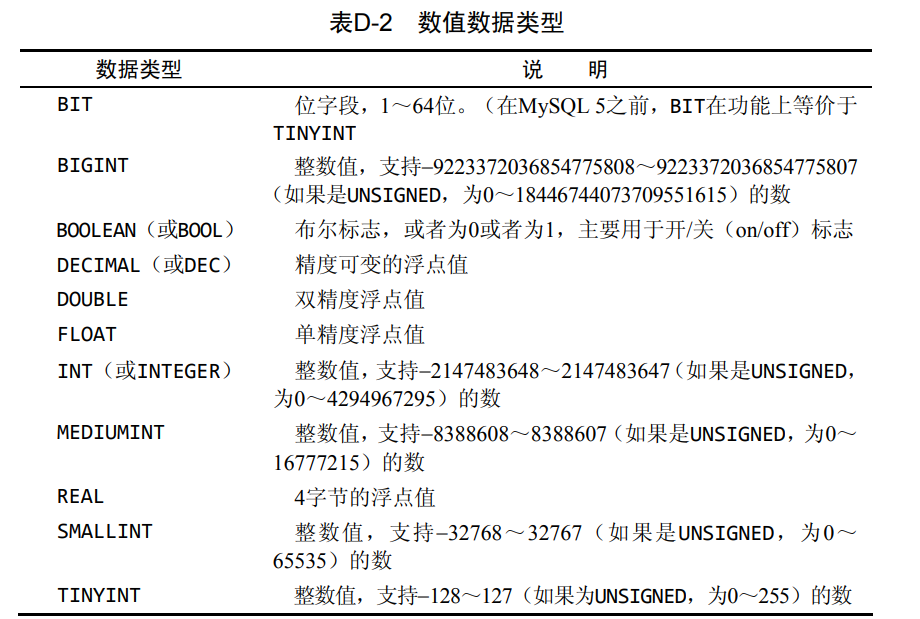
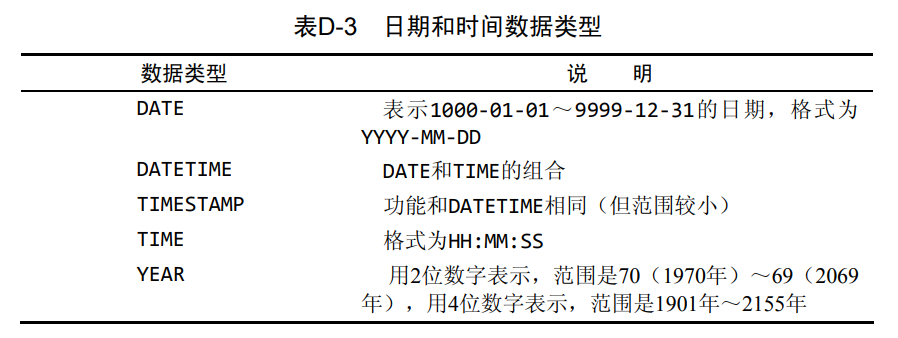
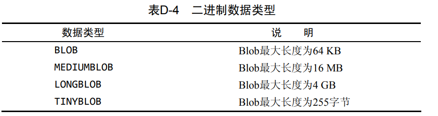

# MySQL必知必会

## ch1 了解SQL

**数据库**：一个文件或者一组文件。

数据库软件称为DBMS（数据库管理系统）。数据库 是通过DBMS创建和操纵的容器。

**表**：存储在表中的数据是一种类型的数据或一个清单。（唯一）

模式（schema）： 关于数据库和表的布局及特性的信息。有时，模式用作数据库的同义词。

**列**（column）： 表中的一个字段。所有表都是由一个或多个列组成的。数据库中每个列都有相应的数据类型。

**行**：表中的一个记录，表中的数据是按行存储的。

**主键**：一列（或一组列），其值能够唯一区分表 中每个行。（必须要有且要不同）

- 任意两行都不具有相同的主键值；

- 每个行都必须具有一个主键值（主键列不允许NULL值）。

**SQL：**一种与数据库通信的语言。


## ch2 MySQL简介

DBMS可分为两类：一类为基于共享文件系统的DBMS，另一类为基 于客户机—服务器的DBMS。	

**MySQL**:MySQL是一种DBMS，即它是一种数据库软件。是基于客户机—服务器的数据库管理系统。

- 服务器软件为MySQL DBMS。你可以在本地安装的副本上运行， 也可以连接到运行在你具有访问权的远程服务器上的一个副本。
- 客户机可以是MySQL提供的工具、脚本语言（如Perl）、Web应用开发语言（如ASP、ColdFusion、JSP和PHP）、程序设计语言（如 C、C++、Java）等。

**MySQL工具（客户机）：**mysql命令行实用程序、MySQL Administrator、MySQL Query Browser。 


## ch3 使用MySQL

### 连接

```sql
mysql -h localhost -P 3306 -u root -p
```

### 选择数据库

```sql
USE crashcourse;
```

### 了解数据库和表

```sql
# 返回可用数据库的一个列表
SHOW DATABASES;
# 返回当前选择的数据库内可用表的列表
SHOW TABLES;
# SHOW 也可以用来显示表列
SHOW COLUMNS FROM customers;
# DESCRIBE 作为 SHOW COLUMNS FROM 的一种快捷方式
DESCRIBE customers;
#################################
# 所支持的其他SHOW语句还有:
# SHOW STATUS用于显示广泛的服务器状态信息
# SHOW CREATE DATABASE和SHOW CREATE TABLE，分别用来显示创建特定数据库或表的MySQL语句
# SHOW GRANTS，用来显示授予用户（所有用户或特定用户）的安全权限；
# SHOW ERRORS和SHOW WARNINGS，用来显示服务器错误或警告消息。
```


## ch4 检索数据

使用SELECT语句从表中检索一个或多个数据列。

### 检索单个列

所需的列名在SELECT关键字之后给出，FROM 关键字指出从其中检索数据的表名。

```SQl
SELECT prod_name
FROM products;
```

结果返回 表中所有的行；结果没有过滤，也没有排序。

### 检索多个列

SELECT 关键字后给出多个列名，列名之间以逗号分隔。

```SQL
SELECT prod_id,prod_name,prod_price
FROM products;
```

### 检索所有列

使用星号（*）通配符检索所有的列

```sql
SELECT *
FROM products;
```

缺点：检索不需要的列通常会降低检索和应 用程序的性能。

优点：由于不明确指定列 名（因为星号检索每个列），所以能检索出名字未知的列。

### 检索不同的行

```SQL
SELECT DISTINCT vend_id
FROM products;
```

SELECT DISTINCT vend_id告诉MySQL只返回不同（唯一）的 vend_id行。

DISTINCT关键字应用于所有列而不仅是前置它的列。

### 限制结果

使用LIMIT子句，返回第一行或前几行。

```sql
SELECT prod_name
FROM products
LIMIT 5;
```

从第0行开始的5行

```sql
SELECT prod_name
FROM products
LIMIT 5,5;
```

从第5行开始的5行

所以带一个值的LIMIT总是从第一行开始，给出的数为返回的行数。 带两个值的LIMIT可以指定从行号为第一个值的位置开始。

LIMIT 4 OFFSET 3意为从行3开始取4行，就像LIMIT 3, 4一样。

### 使用完全限定的表名

完全限定的列名

```sql
SELECT products.prod_name
FROM products;
```

完全限定的表名

```sql
SELECT products.prod_name
FROM crashcourse.products;
```


## ch5 排序检索数据

使用SELECT语句的ORDER BY子句，根据需要排序检索出的数据。

为了明确地排序用SELECT语句检索出的数据，可使用ORDER BY子句。 ORDER BY子句取一个或多个列的名字，据此对输出进行排序。

**用非检索的列排序数据是完全合法的。**

### 排序数据

```sql
SELECT prod_name
FROM products
ORDER BY prod_name;
```

对prod_name列以字母顺序排序数据

### 按多个列排序

```sql
SELECT prod_id,prod_price,prod_name
FROM products
ORDER BY prod_price,prod_name;
```

代码检索3个列，并按其中两个列对结果进行排序——首先按 价格，然后再按名称排序。

**重要的是理解在按多个列排序时，排序完全按所规定的顺序进行。 换句话说，对于上述例子中的输出，仅在多个行具有相同的prod_price 值时才对产品按prod_name进行排序。如果prod_price列中所有的值都是唯一的，则不会按prod_name排序。**

### 指定排序方向

降序：DESC  升序：ASC  默认为升序

按价格以降序排序产品（最贵的排在最前面）

```sql
SELECT prod_id,prod_price,prod_name
FROM products
ORDER BY prod_price DESC;
```

以降序排序产品 （最贵的在最前面），然后再对产品名排序：

```sql
SELECT prod_id,prod_price,prod_name
FROM products
ORDER BY prod_price DESC,prod_name;
```

- 如果想在多个列上进行降序排序，必须 对每个列指定DESC关键字。

使用ORDER BY和LIMIT的组合，能够找出一个列中最高或最低的值。下面的例子演示如何找出最昂贵物品的值：

```sql
SELECT prod_price
FROM products
ORDER BY prod_price DESC
LIMIT 1;
```


## ch6 过滤数据

使用SELECT语句的WHERE子句指定搜索条件。

### 使用 WHERE 子句

在SELECT语句中，数据根据WHERE子句中指定的搜索条件进行过滤。 WHERE子句在表名（FROM子句）之后给出，如下所示：

```sql 
SELECT prod_name,prod_price
FROM products
WHERE prod_price=2.50;
```

从products表中检索两个列，但不返回所有行，只返回prod_price值为2.50的行。这里采用了相等测试。

- 在同时使用ORDER BY和WHERE子句时，应 该让ORDER BY位于WHERE之后，否则将会产生错误

### WHERE子句操作符

= 等于、<> != 等于、BETWEEN 在指定的两个之间

#### 检查单个值

```sql
SELECT prod_name,prod_price
FROM products
WHERE prod_name='fuses';
```

返回prod_name的值 为Fuses的一行。MySQL在执行匹配时默认不区分大小写，所 以fuses与Fuses匹配。

列出价格小于10美元的所有产品：

```sql
SELECT prod_name,prod_price
FROM products
WHERE prod_price < 10;
```

句检索价格小于等于10美元的所有产品

```sql
SELECT prod_name,prod_price
FROM products
WHERE prod_price <= 10;
```

#### 不匹配检查

列出不是由供应商1003制造的所有产品

```sql
SELECT vend_id,prod_name
FROM products
WHERE vend_id <> 1003;
```

<> 可用 ！= 替换

- 单引号用来限定字符串。如果将值与串类型的 列进行比较，则需要限定引号。用来与数值列进行比较的值不 用引号。

#### 检查范围

检索价格在5美元和10 美元之间的所有产品：

```sql
SELECT prod_name,prod_price
FROM products
WHERE prod_price BETWWEN 5 AND 10;
```

这两个值必须用AND关键字 分隔。BETWEEN匹配范围中所有的值，包括指定的开始值和结束值。

#### 空值检查

NULL 无值（no value），它与字段包含0、空字符串或仅仅包含 空格不同。

检查具有NULL值的列。

```sql
SELECT cust_id
FROM customers
WHERE cust_email IS NILL;
```

- 在通过过滤选择出不具有特定值的行时，你 可能希望返回具有NULL值的行。但是，不行。因为未知具有特殊的含义，数据库不知道它们是否匹配，所以在匹配过滤或不匹配过滤时不返回它们。 因此，**在过滤数据时，一定要验证返回数据中确实给出了被过滤列具有NULL的行。**

## ch7 数据过滤

#### 组合WHERE子句

MySQL允许给出多个WHERE子句。这些子 句可以两种方式使用：以AND子句的方式或OR子句的方式使用。

**操作符**（operator） 用来联结或改变WHERE子句中的子句的关键 字。也称为逻辑操作符（logical operator）。

##### AND操作符

**AND 用在WHERE子句中的关键字，用来指示检索满足所有给定条件的行。**

由供应商1003制造且价格小于等于10美元的所有产品的名称和价格。

```sql
SELECT prod_id,prod_price,prod_name
FROM products
WHERE vend_id = 1003 AND prod_price <= 10;
```

##### OR操作符

**OR WHERE子句中使用的关键字，用来表示检索匹配任一给定条件的行。**

由任一个指定供应商制造的所有产品的产品 名和价格。

```sql
SELECT prod_name,prod_price
FROM products
WHERE vend_id = 1003 OR vend_id = 1004;
```

##### 计算次序

AND 高于 OR,圆括号具有较AND或OR操作符高 的计算次序。

列出价格为10美元（含）以上且由1002或1003制 造的所有产品

```sql
SELECT prod_name,prod_price
FROM products
WHERE (vend_id = 1002 OR vend_id = 1003) AND prod_price >= 10;
```

**任何时候使用具有AND和OR操作 符的WHERE子句，都应该使用圆括号明确地分组操作符。**

#### IN 操作符

IN操作符用来指定条件范围，范围中的每个条件都可以进行匹配。

检索供应商1002和1003制造的所有产品。

```sql
SELECT prod_name,prod_price
FROM products
WHERE vend_id IN(1003,1004)
ORDER BY prod_name;
```

**IN操作符完成与OR相同的功能,IN 有其自身的优点**

#### NOT 操作符

NOT WHERE子句中用来否定后跟条件的关键字。

列出除1002和1003之外的所有供应 商制造的产品

```sql
SELECT prod_name,prod_price
FROM products
WHERE vend_id NOT IN (1003,1004)
ORDER BY prod_name;
```

## ch8 用通配符进行过滤

#### LIKE 操作符

**通配符**（wildcard） 用来匹配值的一部分的特殊字符。

**搜索模式**（search pattern）① 由字面值、通配符或两者组合构成的搜索条件。

通配符本身实际是SQL的WHERE子句中有特殊含义的字符，SQL支持几 种通配符。

##### 百分号（%）通配符

%表示任何字符出现任意次数。

例：了找出所有以词jet起头的产品

```sql
SELECT prod_id,prod_name
FROM products
WHERE prod_name LIKE 'jet%';
```

通配符可在搜索模式中任意位置使用，并且可以使用多个通配符。

例：使用两个通配符

```sql
SELECT prod_id,prod_name
FROM products
WHERE prod_name LIKE '%anvil%';
```

**注意点:**

- 除了一个或多个字符外，%还能匹配0个字符。% 代表搜索模式中给定位置的0个、1个或多个字符。
- 尾空格可能会干扰通配符匹配。
- 虽然似乎%通配符可以匹配任何东西，但有一个例 外，即NULL。即使是WHERE prod_name LIKE '%'也不能匹配 用值NULL作为产品名的行。

##### 下划线（_）通配符

下划线的用途与%一样，但下划 线只匹配单个字符而不是多个字符。

```sql
SELECT prod_id,prod_name
FROM products
WHERE prod_name LIKE '_ ton anvil';
```

#### 使用通配符的技巧

通配 符搜索的处理一般要比前面讨论的其他搜索所花时间更长。

**技巧：**

- 不要过度使用通配符。
- 在确实需要使用通配符时，除非绝对有必要，否则不要把它们用 在搜索模式的开始处。把通配符置于搜索模式的开始处，搜索起 来是最慢的。
- 仔细注意通配符的位置。

## ch9 用正则表达式进行搜索

正则表达式是用来匹配文本的特殊的串（字符集合）。

### 使用MySQL正则表达式

正则表达式的作 用是匹配文本，将一个模式（正则表达式）与一个文本串进行比较。MySQL 用WHERE子句对正则表达式提供了初步的支持，允许你指定正则表达式， 过滤SELECT检索出的数据。

#### 基本字符匹配

例：检索列prod_name包含文本1000的所有行：

```sql
SELECT prod_name
FROM products
WHERE prod_name REGEXP '1000'
ORDER BY prod_name;
```

#### 进行OR匹配

为搜索两个串之一（或者为这个串，或者为另一个串），使用|，如下所示：

```sql
SELECT prod_name
FROM products
WHERE prod_name REGEXP '1000 | 2000'
ORDER BY prod_name;
```

#### 匹配几个字符之一

只想匹配特定的字符，可通过指定一组用[和]括起来的字符来完成，如下所示：

```sql
SELECT prod_name
FROM products
WHERE prod_name REGEXP '[123] Ton'
ORDER BY prod_name;
```

[123]定义一组字符，它的意思是匹配1或2或3，因此，1 ton和2 ton都匹配且返回（没 有3 ton）。

#### 匹配范围

集合可用来定义要匹配的一个或多个字符。例如，下面的集合将匹配数字0到9：[0123456789]

范围不限于完整的集合，[1-3]和[6-9]也是合法的范围。此外，范 围不一定只是数值的，[a-z]匹配任意字母字符。

```sql
SELECT prod_name
FROM products
WHERE prod_name REGEXP '[1-5] Ton'
ORDER BY prod_name;
```

#### 匹配特殊字符

匹配特殊字符，必须用 \\ \为前导。\ \ -表示查找-，\ \\ .表示查找.。

```sql
SELECT vend_name
FROM vendors
WHERE vend_name REGEXP '\\.'
ORDER BY vend_name;
```


## ch10 创建计算字段

数据库知道SELECT语句中哪些列是实际的 表列，哪些列是计算字段。

### 拼接字段

将值联结到一起构成单个值。MySQL使用 Concat( ) 函数。Concat()需要一个或多个指定的串，各个串之间用逗号分隔。

例：生成一个供应商报表， 需要在供应商的名字中按照name(location)这样的格式列出供应商的位 置。

```sql
SELECT Concat(vend_name,'(',vend_country,')')
FROM vendors
ORDER BY vend_name;
```

使用别名：

别名（alias）是一个字段或值 的替换名。别名用AS关键字赋予。

```sql
SELECT Concat(vend_name,'(',vend_country,')') AS vend_title
FROM vendors
ORDER BY vend_name;
```

### 执行算术运算

例：检索订单号20005中的所有物品。

```sql
 SELECT prod_id,quantity,item_price
 FROM orderitems
 WHERE order_num = 20005;
```

item_price列包含订单中每项物品的单价。如下汇总物品的价格（单 价乘以订购数量）：

```
SELECT prod_id,quantity,item_price,quantity*item_price AS expanded_price
 FROM orderitems
 WHERE order_num = 20005;
```

## ch11 使用数据处理函数

大多数SQL实现支持以下类型的函数：

- 用于处理文本串（如删除或填充值，转换值为大写或小写）的文本函数。
- 用于在数值数据上进行算术操作（如返回绝对值，进行代数运算） 的数值函数。
- 用于处理日期和时间值并从这些值中提取特定成分（例如，返回 两个日期之差，检查日期有效性等）的日期和时间函数。
- 返回DBMS正使用的特殊信息（如返回用户登录信息，检查版本 细节）的系统函数。

### 文本处理函数

使用RTrim() 函数来去除列值右边的空格。

Upper()将文本转换为大写。

```sql
SELECT vend_name,Upper(vend_name) AS vend_name_upcase
FROM vendors
ORDER BY vend_name;
```

常见文本处理函数：

| Left（）     | 返回串左边的字符  |
| ------------ | ----------------- |
| Length（）   | 返回串的长度      |
| Locate（）   | 找出串的一个子串  |
| Lower（）    | 将串转为小写      |
| LTrim（）    | 去掉串左边的空格  |
| Right（）    | 返回串右边的空格  |
| RTrim（）    | 去掉串右边的空格  |
| Soundex（）  | 返回串的Soundex值 |
| SubSting（） | 返回子串的字符    |
| Upper（）    | 将串转为大写      |

### 日期与时间处理函数

日期必须为 格式yyyy-mm-dd。

| 函数          | 说明                           |
| ------------- | ------------------------------ |
| AddDate()     | 增加一个日期（天、周等）       |
| AddTime()     | 增加一个时间（时、分等）       |
| CurDate()     | 返回当前日期                   |
| CurTime()     | 返回当前时间                   |
| Date()        | 返回日期时间的日期部分         |
| DateDiff()    | 计算两个日期之差               |
| Date_Add()    | 高度灵活的日期运算函数         |
| Date_Format() | 返回一个格式化的日期或时间串   |
| Day()         | 返回一个日期的天数部分         |
| DayOfWeek()   | 对于一个日期，返回对应的星期几 |
| Hour()        | 返回一个时间的小时部分         |
| Minute()      | 返回一个时间的分钟部分         |
| Month()       | 返回一个日期的月份部分         |
| Now()         | 返回当前日期和时间             |
| Second()      | 返回一个时间的秒部分           |
| Time()        | 返回一个日期时间的时间部分     |
| Year()        | 返回一个日期的年份部分         |
|               |                                |

例：检索出一个订单记录，该订单记录 的order_date为2005-09-01。

```sql
SELECT cust_id,order_num
FROM orders
WHERE order_date = '2005-09-01';
```

更可靠的 SELECT语句为：

```sql
SELECT cust_id,order_num
FROM orders
WHERE Date(order_date) = '2005-09-01';
```

例：检索出2005年9月下的 所有订单

```sql
SELECT cust_id,order_num
FROM orders
WHERE Date(order_date) BETWEEN '2005-09-01' AND '2005-09-30';
```

还有另外一种办法（一种不需要记住每个月中有多少天或不需要操 心闰年2月的办法）：

```sql
SELECT cust_id,order_num
FROM orders
WHERE Year(order_date) = 2005 AND Month(order_date) = 9;
```

### 数据处理函数

常用数值处理函数：

| 函数   | 说明               |
| ------ | ------------------ |
| Abs()  | 返回一个数的绝对值 |
| Cos()  | 返回一个角度的余弦 |
| Exp()  | 返回一个数的指数值 |
| Mod()  | 返回除操作的余数   |
| Pi()   | 返回圆周率         |
| Rand() | 返回一个随机数     |
| Sin()  | 返回一个角度的正弦 |
| Sqrt() | 返回一个数的平方根 |
| Tan()  | 返回一个角度的正切 |

## ch12 汇总数据

### 聚集函数

实际想要的是汇总信息。需要汇总数据而不用把它们实际检索出来。

使我们能够对行进行计数，计算和与平均数，获得最大和最小值而不用检索所有数据。

**聚集函数**:运行在行组上，计算和返回单 个值的函数。

**SQL 聚集函数：**

| 函数    | 说明             |
| ------- | ---------------- |
| AVG()   | 返回某列的平均值 |
| COUNT() | 返回某列的行数   |
| MAX()   | 返回某列的最大值 |
| MIN()   | 返回某列的最小值 |
| SUM()   | 返回某列值之和   |

#### AVG()函数

AVG()只能用来确定特定数值列的平均值，而 且列名必须作为函数参数给出。为了获得多个列的平均值， 必须使用多个AVG()函数。

例：返回products表中所有产品的平均价格

```sql
SELECT AVG(prod_price) AS avg_price
FROM products;
```

AVG()也可以用来确定特定列或行的平均值:

```sql
SELECT AVG(prod_price) AS avg_price
FROM products
WHERE vend_id = 1003;
```

#### COUNT（）函数

COUNT()函数进行计数。可利用COUNT()确定表中行的数目或符合特定条件的行的数目。

COUNT()函数有两种使用方式。

- 使用COUNT(*)对表中行的数目进行计数，不管表列中包含的是空 值（NULL）还是非空值。
- 使用COUNT(column)对特定列中具有值的行进行计数，忽略 NULL值。

### 聚集不同值

例：使用AVG()函数返回特定供应商提供的产品的平均价格。

```sql
SELECT AVG(DISTINCT prod_price) AS avg_price
FROM products
WHERE vend_id = 1003;
```

### 组合聚集函数

```sql
SELECT COUNT(*) AS num_items,
		MIN(prod_price) AS price_min,
		MAX(prod_price) AS price_max,
		AVG(prod_price) AS price_avg
FROM products;
```


## ch13 分组数据

### 数据分组

GROUP BY

例子：

```sql
SELECT vend_id,count(*) AS num_prods
FROM products
GROUP BY vend_id;
```

#### 过滤分组

HAVING

HAVING非常类似于WHERE 。唯一的差别是 WHERE过滤行，而HAVING过滤分组。

例：列出至少有两个订单的所有 顾客。

```sql
SELECT cust_id,COUNT(*) AS orders
FROM orders
GROUP BY cust_id
HAVING COUNT(*)>=2;
```

**同时使用WHERE和HAVING**

例：列出具有2个（含）以上、价格 为10（含）以上的产品的供应商：

```sql
SELECT vend_id,COUNT(*) AS num_prods
FROM products
WHERE prod_price >= 10
GROUP BY vend_id
HAVING COUNT(*) >= 2;
```

### 分组和排序

ORDER BY与GROUP BY的差别：

| ORDER BY                                      | GROUP BY                                                     |
| --------------------------------------------- | ------------------------------------------------------------ |
| 排序产生的输出                                | 分组行。但输出可能不是分组的顺序                             |
| 任意列都可以使用（甚至 非选择的列也可以使用） | 只可能使用选择列或表达式列，而且必须使用每个选择 列表达式 不一定需要 如果与聚集函数 |
| 不一定需要                                    | 如果与聚集函数一起使用列（或表达式），则必须使用             |

一般在使用GROUP BY子句时，应该也给 出ORDER BY子句。这是保证数据正确排序的唯一方法。千万 不要仅依赖GROUP BY排序数据。

例：检索总计订单价格大于等于50的订单的订单号和总计订单价格：

```sql
SELECT order_num,SUM(quantity*item_price) AS total_price
FROM orderitems
GROUP BY order_num
HAVING total_price >= 50
ORDER BY total_price;
```

分析：GROUP BY子句用来按订单号（order_num列） 分组数据，以便SUM(*)函数能够返回总计订单价格。HAVING子 句过滤数据，使得只返回总计订单价格大于等于50的订单。最后，用ORDER BY子句排序输出。

### SELECT 字句顺序

SELECT子句及其顺序：

| 子句     | 说明               | 是否必须使用           |
| -------- | ------------------ | ---------------------- |
| SELECT   | 要返回的列或表达式 | 是                     |
| FROM     | 从中检索数据的表   | 仅在从表选择数据时使用 |
| WHERE    | 行级过滤           | 否                     |
| GROUP BY | 分组说明           | 仅在按组计算聚集时使用 |
| HAVING   | 组级过滤           | 否                     |
| ORDER BY | 输出排序顺序       | 否                     |
| LIMIT    | 要检索的行数       | 否                     |


## 附录A： MySQL入门

### 需要什么

为使用MySQL和学习本书中各章的内容，你需要访问MySQL服务器和客户机应用（用来访问服务器的软件）副本。

**服务器**：（不一定需要自己安装MySQL副本，但需要访问服务器。基本上有下面两种选择。）

- 访问一个已有的MySQL服务器，或许是你的公司或许是商用的或院校的服务器。为使用这个服务器，你需要得到一个服务器账号 （一个登录名和一个口令。）
- 下载MySQL服务器的一个免费副本，安装在你自己的计算机上。

**客户及软件：**（用来实际运行 MySQL命令的程序）

- mysql命令行实用程序
- MySQL Adiminstrator
- MySQL Query Browser

### 获得软件

学习更多的mysql知识：http://dev.mysql.com/

下载服务器的一个副本：http://dev.mysql.com/downloads/

MySQL Adiminstrator和MySQL Query Browser不作为MySQL的核心 部分安装，必须从http://dev.mysql.com/downloads/下载。

### 安装软件

你要安装一个本地MySQL服务器，应该在安装可选的MySQL实 用程序之前进行。

所有安装都会提示你 输入需要的信息，包括：（不确定要指定什么，默认就好）

- 安装位置
- root用户的口令
- 端口、服务或进程名等

多个MySQL服务器的副本可安装在单台机器上，只要每个服务器使用不同的端口即可。

## 附录B：样例表

### 样例表

随身物品推销商使用的**订单录入系统**

使用6张表完成任务：

- 管理供应商
- 管理产品目录
- 管理顾客列表
- 录入顾客订单


**vendors表**：



- 表示存储销售产品的供应商
- vend_id 列用来匹配产品和供应商
- vend_id 作为主键。vend_id为一个自动增量字段。

**products表**：



- 产品目录，每行一个产品
- prod_id 作为主键
- 为实施引用完整性，在vend_id 上定义一个外键，关联到vendors的vend_id。

**customers表：**



- 存储所有顾客的信息
- cust_id 为主键，是一个自动增量字段。

**orders表：**


- 存储顾客订单（不是订单细节）
- order_num为主键，是一个自动增量字段。
- 为实施引用完整性，在cust_id 上定义一个外键，关联到customers的cust_id。

**orderitems表：**



- 存贮每个订单中的实际物品，每个订单的每个物品占一行。
- order_num和order_item 作为主键。
- 为实施引用完整性，在order_num上定义外键，关联它到 orders表的order_num，在prod_id上定义外键，关联它到products 表 的prod_id。

**productnotes表：**



- 存储与特定产品有关的注释。
- note_id 为主键。
- 列note_text必须为FULLTEXT搜索进行索引。
- 由于这个表使用全文本搜索，因此必须指定ENGINE=MyISAM。

### 创建样例表

下载相关：http://www.forta.com/books/0672327120/

步骤（mysql命令行实用程序）：

1. 创建一个数据源
2. 选择这个数据源，用`USE` 命令。
3. 执行`create.sql`脚本，`source create.sql`(指定create.sql文件的完全路径)。
4. 重复前面的步骤，用populate.sql文件填充各个新表。

## 附录C：MySQL语句的语法

最常使用 的MySQL语句的语法。每条语句以简要的描述开始，然后给出它的语法。 为增加方便性，还给出对讲授相应语句的章的交叉引用。


## 附录D:MySQL数据类型

### 串数据类型

两种基本的串数据类型：

- 定长串

长度固定，长度在创建表时指定。

- 变长串

长度可变，`TEXT`属于变长串类型



**既然变长数据类型这样灵活，为什么还要使用定长数据类型？**

答：因为性能。MySQL处理定长列远比处理变长列快得多。此外，MySQL不 允许对变长列（或一个列的可变部分）进行索引。这也会极大地影响性能。

**注：**不管使用何种形式的串数据类型，串值都必须括在引号内（通常单引号更好）。电话号码和邮政编码使用串类型存储。

### 数值数据类型



### 日期和时间数据类型



### 二进制数据类型

二进制数据类型可存储任何数据（甚至包括二进制信息），如图像、 多媒体、字处理文档等

